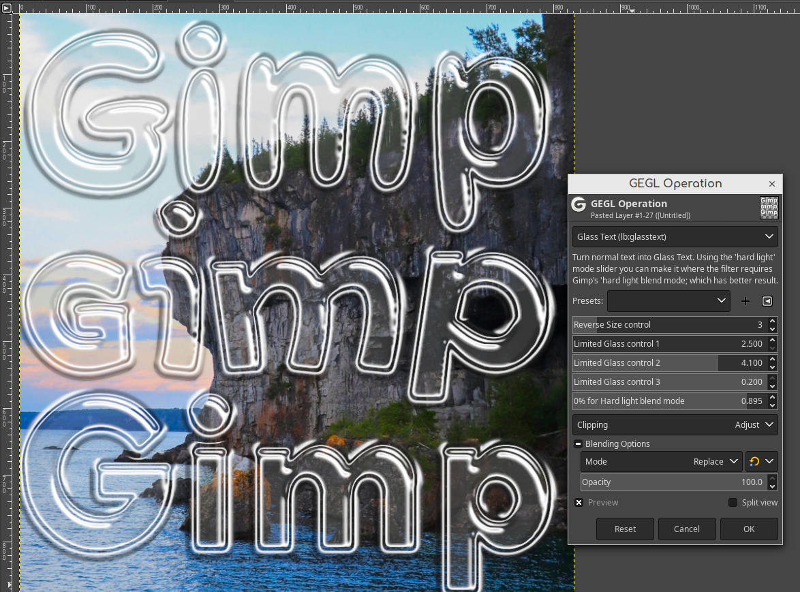

Glass Text Gimp Plugin (NOT TO BE CONFUSED WITH MY GLASS OVER TEXT PLUGIN THAT SHIPS WITH GEGL EFFECTS)
This plugin ships with two other bonus plugins "glossy balloon and metallic" that are needed for it to work.
They are quality plugins of their own. 

**Previews of this plugin**




**Previews of the bonus plugins it ships with**

Home page of bonus plugins (remember, these are full filters of their own)

https://github.com/LinuxBeaver/GEGL-glossy-balloon-text-styling

https://github.com/LinuxBeaver/gegl-metallic---Make-people-metal-with-GEGL


Location to put binaries, they do NOT go in the normal plugins folder.

##Windows
 C:\Users\(USERNAME)\AppData\Local\gegl-0.4\plug-ins
 
##Linux 
 /home/(USERNAME)/.local/share/gegl-0.4/plug-ins
 
##Linux (Flatpak includes Chromebook)
 /home/(USERNAME)/.var/app/org.gimp.GIMP/data/gegl-0.4/plug-ins

Then restart Gimp and to go GEGL Operations to find the plugin. 
If you use Gimp 2.99.16+ you will see it in filters>text styling. 
If you have my layer effects plugin to you will see another plugin
named "glass over text" which is not the same thing and not needed
for this to work. 


## Compiling and Installing

### Linux

To compile and install you will need the GEGL header files (`libgegl-dev` on
Debian based distributions or `gegl` on Arch Linux) and meson (`meson` on
most distributions).

```bash
meson setup --buildtype=release build
ninja -C build

```

If you have an older version of gegl you may need to copy to `~/.local/share/gegl-0.3/plug-ins`
instead (on Ubuntu 18.04 for example).

BEAVER RECOMMENDS YOU USE A MODERN VERSION OF GEGL. NO GUARANTEE DATED VERSIONS OF GIMP WILL WORK WITH THIS PLUGIN 
IT SEEMS VERSIONS OF GIMP BEFORE VERY LATE 2019 DON'T WORK WITH MY PLUGINS BUT TO BE SMART USE A MODERN VERSION

### Windows

The easiest way to compile this project on Windows is by using msys2.  Download
and install it from here: https://www.msys2.org/

Open a msys2 terminal with `C:\msys64\mingw64.exe`.  Run the following to
install required build dependencies:

```bash
pacman --noconfirm -S base-devel mingw-w64-x86_64-toolchain mingw-w64-x86_64-meson mingw-w64-x86_64-gegl
```

Then build the same way you would on Linux:

```bash
meson setup --buildtype=release build
ninja -C build
```


## more previews


